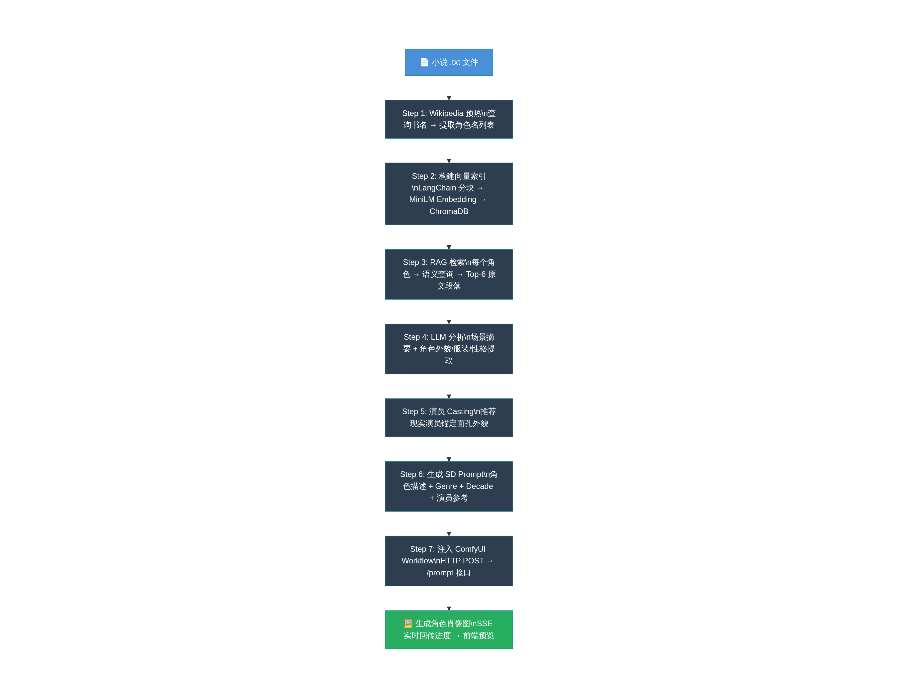
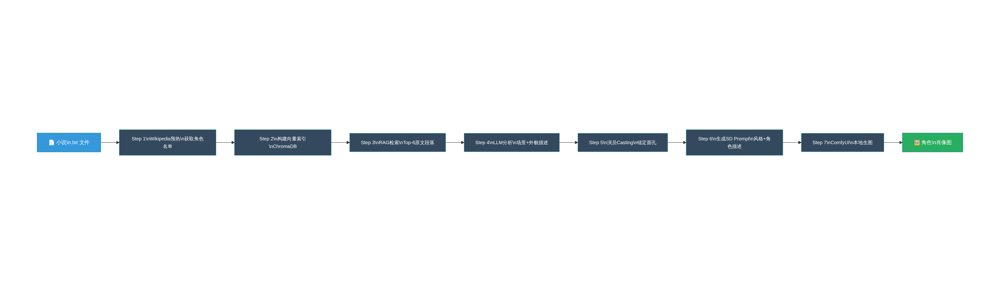

# CharacterGeneration 项目完整学习笔记
## 项目地址：https://github.com/snorcack/CharacterGeneration

---

# 一、项目是什么

从小说 .txt 文件出发，通过 RAG 技术检索角色相关原文，
结合本地 LLM（Ollama/Gemma）理解角色，最终调用本地 ComfyUI 生成角色肖像图。
整个流程 100% 在本地运行，无需任何云 API。

技术栈：
- 后端：Python + FastAPI
- LLM：Ollama（本地）
- 向量数据库：ChromaDB
- Embedding 模型：all-MiniLM-L6-v2
- 图像生成：ComfyUI（本地）
- 前端：React + Vite

---

# 二、工作原理（七步流水线）

## Step 1：Wikipedia 预热 → 获取角色名单
  输入：书名（字符串）
  过程：查询 Wikipedia 抓取书籍百科页面（最多15000字）→ 交给 LLM 提取主要角色名
  输出：["Elizabeth Bennet", "Mr. Darcy", ...]
  意义：不扫描全书，快速锁定角色名，作为 RAG 检索的入口

## Step 2：构建书籍向量索引（RAG核心）
  输入：小说 .txt 文件
  过程：
    LangChain TextLoader 读取全文
    → RecursiveCharacterTextSplitter 切块（1000字/块，200字重叠）
    → all-MiniLM-L6-v2 Embedding 向量化
    → 存入本地 ChromaDB（持久化，下次直接复用）
  输出：ChromaDB 向量索引

## Step 3：RAG 检索角色相关场景
  输入：角色名
  过程：构造语义查询句 → ChromaDB 相似度搜索
  输出：Top-6 最相关原文段落（原著的真实文字）
  意义：用原著"证据"喂给 LLM，防止 LLM 乱编

## Step 4：LLM 分析角色（两件事并行）
  ① 场景摘要：每段原文 → 生成不超过12词的短标签（在UI下拉框显示）
  ② 角色分析：提取发色/眼色/体型/年龄/常见服装/常出现场所/性格特征

## Step 5：演员 Casting（视觉锚定）
  输入：角色描述 + 用户选择的风格（类型/年代/地区）
  过程：LLM 推荐一位现实演员来"扮演"这个角色
  输出：演员名字（写入 SD Prompt）
  意义：利用 SD 对名人面孔的学习，锚定角色外貌，减少生图随机性

## Step 6：生成 SD Prompt（最终图像描述）
  固定规则：
    - 核心身份（年龄/种族/面部特征）：严格保持，不可改动
    - 外观改编（服装/发型/灯光）：根据 Genre 完全重塑
    - 场景环境：背景和氛围反映 Genre 风格
    - 演员参考："该角色的面孔应近似于演员：XXX"
    - 画质要求：Photorealistic, cinematic, high detail 8k
  用户可选维度：
    - Genre：Horror / Cyberpunk / Fantasy / 写实 等
    - Decade：1920s Noir / 1980s Sci-Fi / 2000s 等

## Step 7：ComfyUI API 对接
  过程：
    将 Step 6 生成的 Prompt 注入 Workflow JSON 的对应节点
    → HTTP POST 提交到 ComfyUI 本地 /prompt 接口
    → SSE（Server-Sent Events）订阅进度
    → 前端实时显示进度条 → 完成后预览图片

---

# 三、Windows 本地部署操作步骤

## 前置准备

### 1. 安装 Ollama（本地LLM运行环境）
  下载地址：https://ollama.com/download
  安装后打开命令提示符执行：
    ollama pull gemma3:4b
  等待下载完成（约3.3GB）

### 2. 安装 ComfyUI
  git clone https://github.com/comfyanonymous/ComfyUI
  cd ComfyUI
  pip install -r requirements.txt

  安装必要插件（必须安装，否则无法生图）：
    cd custom_nodes
    git clone https://github.com/martin-rizzo/ComfyUI-ZImagePowerNodes

  启动 ComfyUI：
    python main.py
    → 访问 http://127.0.0.1:8188 确认正常运行

### 3. 安装 Python 3.10+
  下载地址：https://www.python.org/downloads/
  安装时勾选 "Add Python to PATH"

### 4. 安装 Node.js 18+
  下载地址：https://nodejs.org/

---

## 安装项目

  git clone https://github.com/snorcack/CharacterGeneration
  cd CharacterGeneration

  # 安装后端依赖
  cd charactergenerate\backend
  pip install -r requirements.txt

  # 安装前端依赖
  cd ..\frontend
  npm install

---

## 启动服务（需要同时运行以下4个）

  方法一：双击 run_app.bat（项目自带，Windows 专用）
    路径：CharacterGeneration\charactergenerate\run_app.bat

  方法二：手动分别启动（推荐，方便看报错）

    窗口1 - 启动 Ollama：
      ollama serve

    窗口2 - 启动 ComfyUI：
      cd ComfyUI
      python main.py

    窗口3 - 启动后端：
      cd CharacterGeneration\charactergenerate\backend
      python main.py
      → 运行在 http://localhost:8000

    窗口4 - 启动前端：
      cd CharacterGeneration\charactergenerate\frontend
      npm run dev
      → 访问 http://localhost:5173

---

## 使用流程（在浏览器 http://localhost:5173 操作）

  1. Load a Book
     输入小说 .txt 文件的完整路径，如：C:\novels\三体.txt
     点击加载，等待建立向量索引（首次处理大概需要几分钟）

  2. Choose a Character
     从 AI 自动识别出的角色列表中选择一个角色

  3. Analyze
     点击分析，AI 从原著检索相关场景，生成角色描述
     下拉框里可以看到6个场景摘要标签

  4. Cast an Actor
     选择年代/地区风格，AI 推荐一个匹配的现实演员

  5. Configure
     选择 Genre（如 Fantasy / Cyberpunk）
     选择 Decade（如 1980s / 2000s）

  6. Connect ComfyUI
     在 UI 里填写：http://127.0.0.1:8188
     上传 Workflow JSON：
       路径：CharacterGeneration\charactergenerate\backend\ZSamplerWorkflow2.json

  7. Generate
     点击生成，等待进度条完成，角色肖像图直接在页面预览

---

## 小说文件格式要求

  - 必须是 .txt 纯文本格式
  - 如果是 epub/pdf，需要先转换：

    epub 转 txt（Windows）：
      安装 Calibre（https://calibre-ebook.com/download）
      打开 Calibre → 右键书籍 → 转换书籍 → 输出格式选 TXT

    或 Python 方式：
      pip install ebooklib beautifulsoup4
      （需要自己写几行代码解析）

---

## 常见问题排查

  问题：后端启动报"model not found"
  原因：Ollama 未拉取模型
  解决：执行 ollama pull gemma3:4b

  问题：ComfyUI 报"missing node"错误
  原因：未安装 ZImagePowerNodes 插件
  解决：按上面安装插件步骤操作，然后重启 ComfyUI

  问题：首次加载书籍很慢
  原因：需要自动下载 all-MiniLM-L6-v2 Embedding 模型（约80MB）
  解决：等待下载完成，后续会快很多（模型缓存在本地）

  问题：前端无法连接后端
  原因：端口冲突或后端未启动
  解决：确认后端在8000端口，前端在5173端口

  问题：中文小说角色识别/描述效果差
  原因：gemma3:4b 对中文理解有限
  解决：改用中文友好的模型，在 character_gen.py 里替换：
    model="gemma3:4b" → model="qwen2.5:7b"

---

# 四、架构总结

  小说.txt
      ↓ LangChain + 分块
  ChromaDB 向量索引
      ↓ 语义相似度检索
  6段原文场景
      ↓ Ollama LLM（Gemma）
  角色描述 + 场景标签
      ↓ 用户选择（genre/decade/演员）
  SD Prompt 文本
      ↓ 注入 ComfyUI Workflow JSON
  ComfyUI 本地生成（ZImagePowerNodes）
      ↓ SSE 实时回传
  前端展示角色肖像图

  LLM 只负责：文字 → 文字（理解和翻译）
  ComfyUI 负责：文字 → 图像（最终生图）
  二者通过 FastAPI 后端完全解耦

---

笔记整理时间：2026-05-06
来源：https://github.com/snorcack/CharacterGeneration
